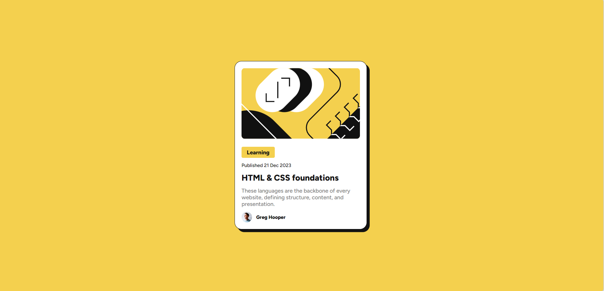

# Frontend Mentor - Blog preview card solution

This is a solution to the [Blog preview card challenge on Frontend Mentor](https://www.frontendmentor.io/challenges/blog-preview-card-ckPaj01IcS). Frontend Mentor challenges help you improve your coding skills by building realistic projects.

## Table of contents

- [Overview](#overview)
  - [The challenge](#the-challenge)
  - [Screenshot](#screenshot)
  - [Links](#links)
- [My process](#my-process)
  - [Built with](#built-with)
  - [What I learned](#what-i-learned)
- [Author](#author)

## Overview

A fun challenge to create a card for a blog preview, adding some nice hover effects.
This is my second challenge. I hope I got it right!

I certainly learned a lot from the previous one, and a lot more from this!
I'm very open to criticism, so please go ahead!

### The challenge

Users should be able to:

- See hover and focus states for all interactive elements on the page

### Screenshot

### Links

- Solution URL: [Add solution URL here](https://github.com/DanCodeCraft/fem-BlogPreviewCard.git)
- Live Site URL: [Add live site URL here](https://fem-blog-preview-card-one.vercel.app/)

## My process

- First I reset all the defaults
- Created the divs to built the HTML structure
- Added the image and worked on how the layout would work best to avoid having extra work when adapting it to smaller screens
- Styled following the given directions
- Added the hover effects, one for the main card, one for the title/link

### Built with

- Semantic HTML5 markup
- CSS custom properties
- Flexbox
- Desktop-first workflow
- Media query

### What I learned

I definitely was able to improve my workflow and how to think about the end of the project, rather than just starting from point A, hoping to achieve points B and C.

## Author

- Website - [LinkedIn](https://www.linkedin.com/in/adannjacinto/)
- Frontend Mentor - [@DanCodeCraft](https://www.frontendmentor.io/profile/DanCodeCraft)
- Twitter - [@DanCodeCraft](https://twitter.com/DanCodeCraft)
